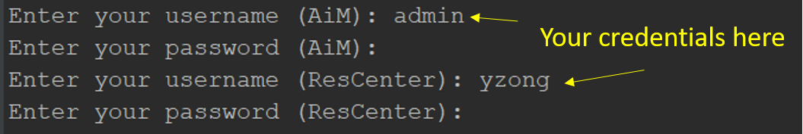

# To Run the program

1. Double click run.bat file. Make sure Logs.xlsx is **NOT** open.

2. Fill in the AiM/ResCenter login username and password in the command line window, note that the password won't be shown on the screen. Click enter and the program will continue.

   

3. A successful running should generate the screenshot below. 

   

4. In any circumstances the program crushes, it should throw out an error like below. Please take a screenshots and contact Tim Zong for help.


# Important Notes for Users

1. Please do not change any file names or contents.
4. Always check the Logs.xlsx after the program finishes. The program should continue running while logging the error. 
3. Please go to AiM/ResCenter to double check the rows with "Error" status (from Logs.xlsx). If not logged, please manually make changes in both systems
4. FYI, this program follows [steps in ResCenter](/Steps in ResCenter.md)
5. If there are any questions or improvement suggestions, feel free to contact Tim.


# Install the program (for developers only)

1. Install [Miniconda (Python)](https://docs.conda.io/en/latest/miniconda.html)  on your local machine. You can access conda via the console, to make sure it's properly installed please run `conda -V` to display the version.

2. Create new virtual environment. Open Anaconda Prompt and run:

   ```conda create --name selenium_env python==3.12 –y```

3. Once it's created you can activate it by running: ```conda activate selenium_env```

4. Go to the current directory, run ```pip install -r requirements.txt``` under the activated virtual environment

5. Setup environment variables for Windows 10 System. Typical path is :C:\Users\user_ID\AppData\Local\Continuum\miniconda3\envs\selenium_env

6. To show hidden files in Windows 10:


7. Run the run_demo.bat, it will call HMS_to_AiM(demo).py, and check if everything works.