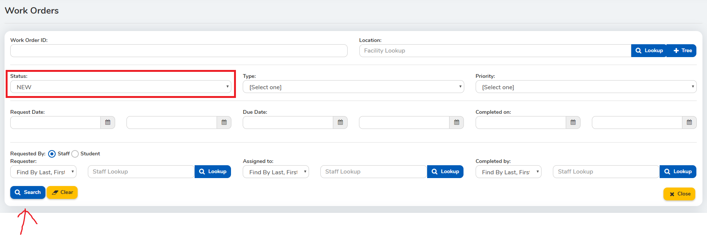
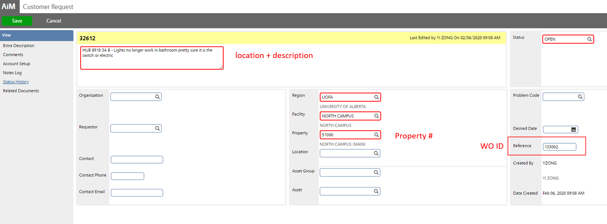

# Steps in ResCenter

1. Login, go to Facilities->Work Orders
2. Change status to "NEW"

3. Select the top record from the list.

4. Read & store information

   

5. Log customer request into AiM

   

   

6. update ResCenter records, description -> “AiM CR ##### - ”original description

   

7. Wait until the success alert pops up, then close it and go back to the search page.

   

8. Go to the next record, and proceed.

   

# Exceptions

1. If WO type is either "Contractor" or "Pest Control", then this record **won't** be logged into AiM, and status will be changed to "**Pending ASIWC Approval**".

2. In some cases, the mandatory location field is missing, capture the error.

   

   change status to "Pending ASIWC Approval", auto fill location to "ASIWC Office"

   

   